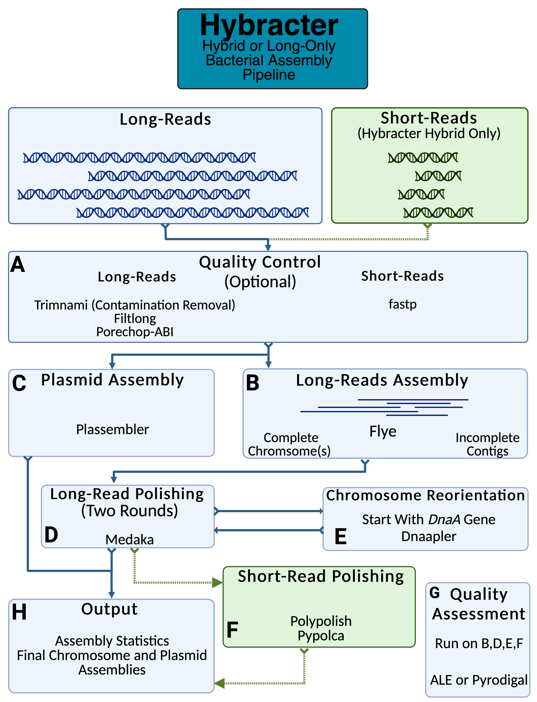

# `hybracter`

`hybracter` is an automated long-read first bacterial genome assembly pipeline implemented in Snakemake using [Snaketool](https://github.com/beardymcjohnface/Snaketool).

## Overview

`hybracter` is designed for assembling bacterial isolate genomes using a long read first assembly approach. 
It scales massively using the embarassingly parallel power of HPC and Snakemake profiles. It is designed for applications where you have isolates with Oxford Nanopore Technologies (ONT) long reads and optionally matched paired-end short reads for polishing.

`hybracter` is desined to straddle the fine line between being as fully feature-rich as possible with as much information as you need to decide upon the best assembly, while also being a one-line automated program. In other words, as awesome as Unicycler, but updated for 2023. Perfect for lazy people like myself.

`hybracter` is largely based off Ryan Wick's [magnificent tutorial](https://github.com/rrwick/Perfect-bacterial-genome-tutorial) and associated [paper](https://doi.org/10.1371/journal.pcbi.1010905). `hybracter` differs in that it adds some additional steps regarding targeted plasmid assembly with [plassembler](https://github.com/gbouras13/plassembler), contig reorientation with [dnaapler](https://github.com/gbouras13/dnaapler) and extra polishing and statistical summaries.

- A. Reads are quality controlled with [Filtlong](https://github.com/rrwick/Filtlong), [Porechop](https://github.com/rrwick/Porechop), [fastp](https://github.com/OpenGene/fastp) and optionally contaminant removal using modules from [trimnami](https://github.com/beardymcjohnface/Trimnami).
- B. Long-read assembly is conducted with [Flye](https://github.com/fenderglass/Flye). Each sample is clssified if the chromosome(s) were assembled (marked as 'complete') or not (marked as 'incomplete') based on the given minimum chromosome length.
- C. For complete isolates, plasmid recovery with [Plassembler](https://github.com/gbouras13/plassembler).
- D. For all isolates, long read polishing with [Medaka](https://github.com/nanoporetech/medaka).
- E. For complete isolates, the chromosome is reorientated to begin with the dnaA gene with [dnaapler](https://github.com/gbouras13/dnaapler).
- F. For all isolates, if short reads are provided, short read polishing with [Polypolish](https://github.com/rrwick/Polypolish) and [pypolca](https://github.com/gbouras13/pypolca).
- G. For all isolates, assessment of all assemblies with [ALE](https://github.com/sc932/ALE) for `hybracter hybrid` or [Pyrodigal](https://github.com/althonos/pyrodigal) for `hybracter long`.
- H. The best assembly is selected and and output along with final assembly statistics.

